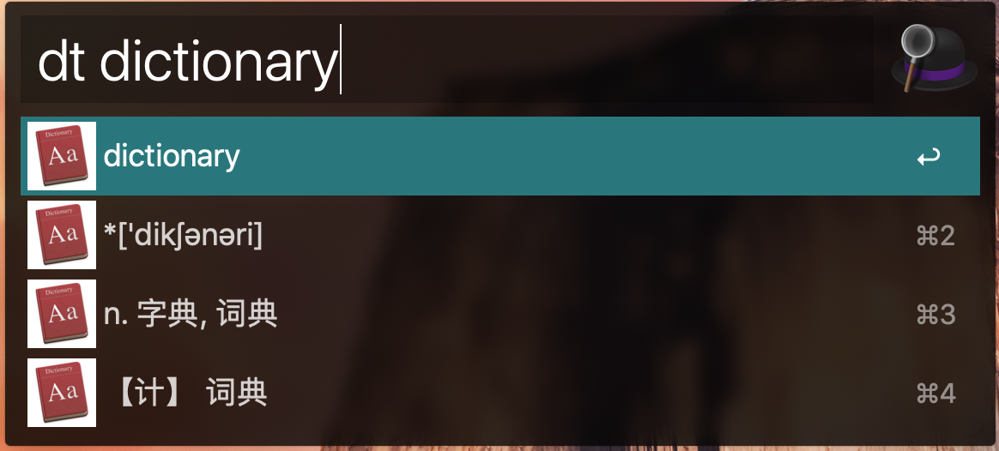
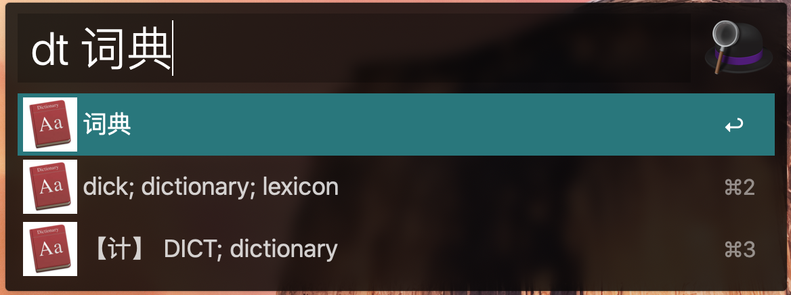

# dict_alfred

This is an Alfred workflow to display results of Mac built-in dictionary within Alfred (for Chinese-English or English-Chinese). 

Install the workflow in Alfred and type "dt [query]" to use. 

### Examples

